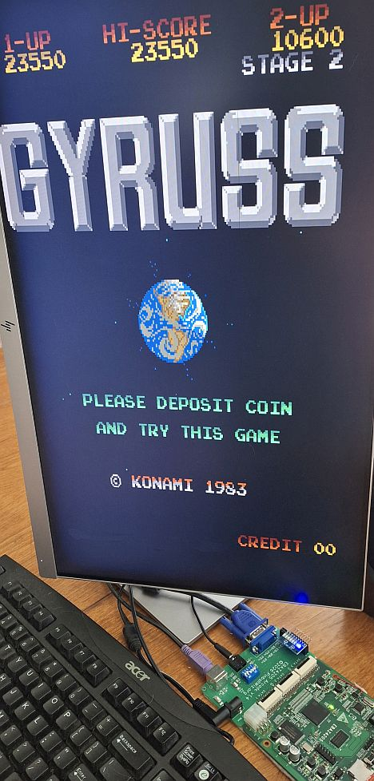

# EBAZ4205 - Gyruss

Gyruss Arcade vhdl code ported to an EBAZ-4205 ZYNQ-7010 FPGA Board by PinballWiz.org 2026.  
Works with VGA Monitor. This game is part of the ZYNQ Arcade Platform (see included docs).  
Original Verilog sources from Mister-X.
